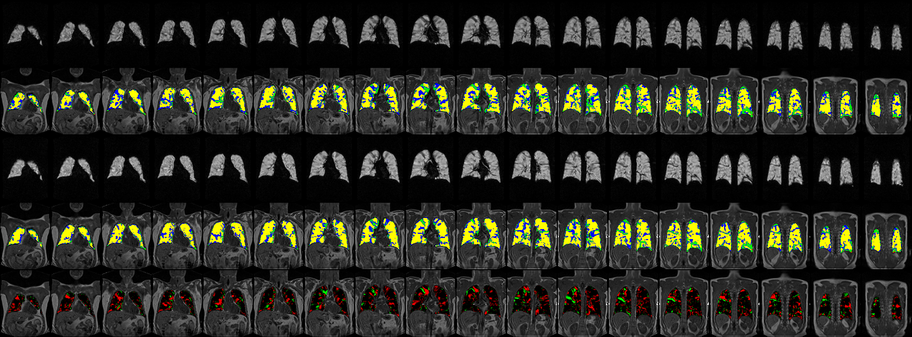
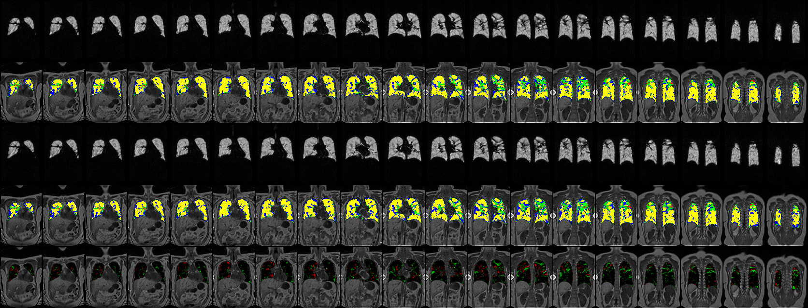
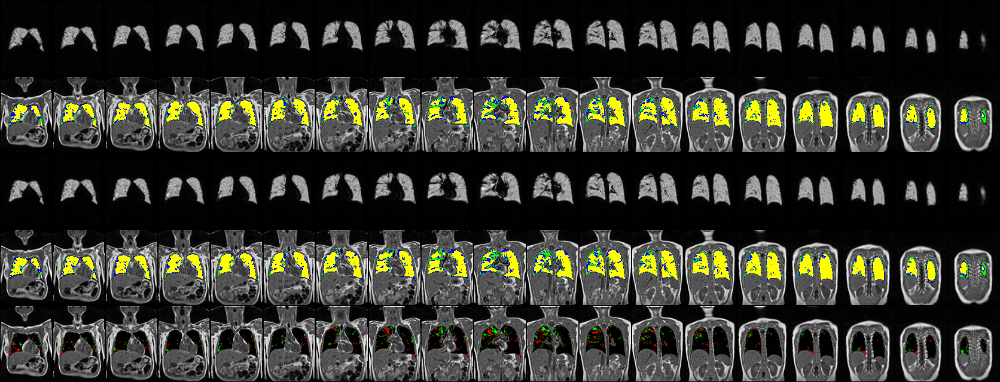
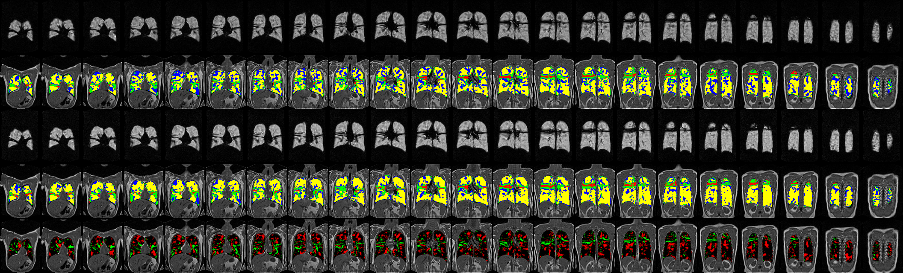
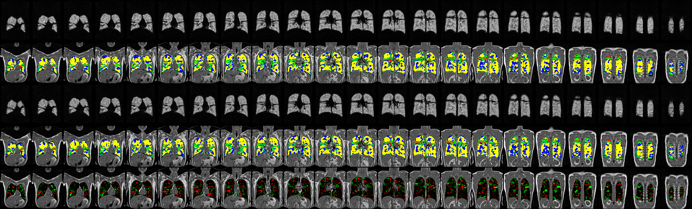
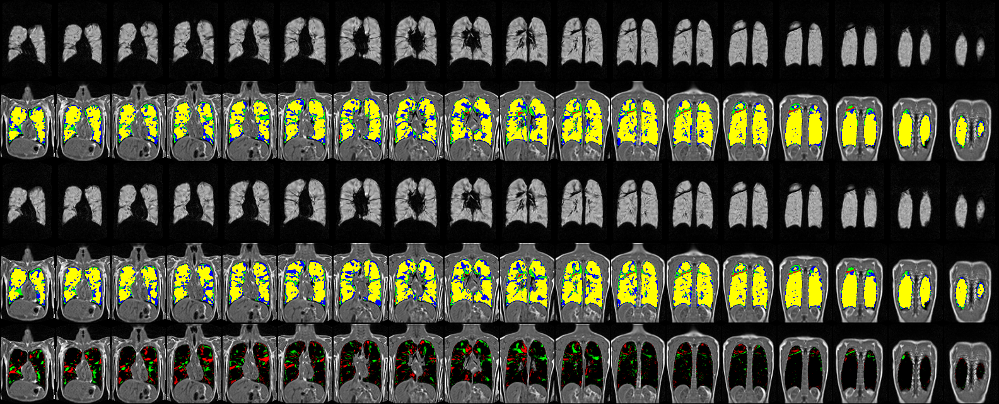

# Subject901

## Subject901 -- VX770_025901_198

## Subject901 -- VX770_025901_239

# Subject902

## Subject902 -- VX770_025902_228

## Subject902 -- VX770_025902_455

## Subject902 -- VX770_025902_780

# Subject904

## Subject904 -- VX770_025904_283

## Subject904 -- VX770_025904_398

## Subject904 -- VX770_025904_592

# Subject907

## Subject907 -- VX770_025907_515

## Subject907 -- VX770_025907_593

## Subject907 -- VX770_025907_690

# Subject909

## Subject909 -- VX770_025909_203

## Subject909 -- VX770_025909_679

## Subject909 -- VX770_025909_782

# Subject910

## Subject910 -- VX770_025910_158

## Subject910 -- VX770_025910_737

## Subject910 -- VX770_025910_773

# Subject913

## Subject913 -- VX770_025913_403

